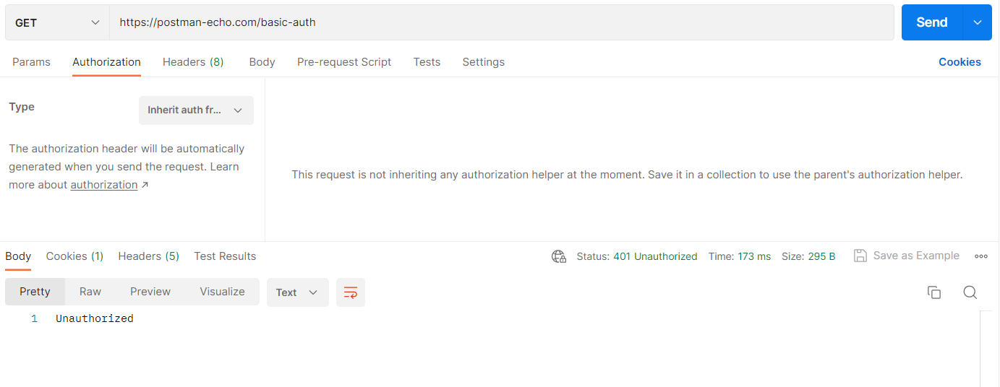

# API-Assignment

1. Make API calls using the following URIs and record the status code and response body for each API call (You will write the answer after every question and any screen capture in this document)
Get authentication token using URI: https://postman-echo.com/basic-auth
Question:

a. How did you get the response?

Ans: 

Get information about all users using URI: https://reqres.in/api/users
Question:

How many lists can you see in the response body?
Get information about the user with id 3 using URI: https://reqres.in/api/users/3
Question:

How many lists can you see in the response body?
What are the available property(Key) names in the response body?
Delete the User with id 9 using URI https://reqres.in/api/users/9
Question:

What is the response?
How many users are now on the users list? https://reqres.in/api/users
Can you see the deleted user record?
Get information of the user with id 40 using URI: https://reqres.in/api/users/40
Question:

How many lists can you see in the response body?
What are the available property(Key) names in the response body?